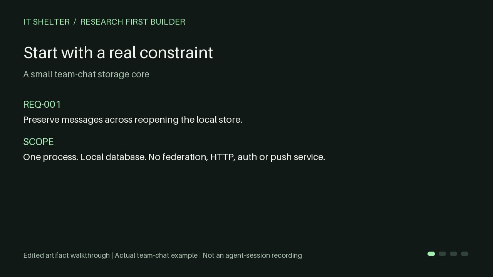

# Research First Builder

**Make your coding agent justify architecture with real sources before it builds.**

Don't build from vibes. Build from evidence.

Research First Builder is one portable agent skill by [IT Shelter](https://github.com/IT-Shelter-Labs).
It turns relevant software references into scoped **ADOPT / REJECT / DEFER** decisions, a minimal plan,
and verification linked back to those decisions. An offline helper checks the artifact contract.

**0.1.0 release candidate:** working local package, examples and a [desktop full-workflow test](docs/acceptance/DESKTOP_BOOKMARKS.md).
Native selector acceptance and comparative evaluation remain incomplete. See [actual test status](docs/COMPATIBILITY.md).
[Русский](README_RU.md) · [Quick start](docs/QUICKSTART.md) · [Examples](examples/README.md)



The animation is an edited artifact walkthrough of the included team-chat example, not an agent-session recording.

## Why use it?

Research alone is cheap. Deciding which parts of a reference fit **your** task is harder.

- Sources have inspectable locations, timestamps and limits; documented facts, inspected code, observations and inferences stay distinct.
- Every consequential decision names its requirement, evidence, simpler alternative, complexity cost and revisit trigger.
- Rejected complexity receives a post-build diff review. **NO-PATTERN** is a valid result.
- Human reports and a single JSON ledger stay connected; checks catch broken trace, stale planning and inconsistent test snapshots.
- One self-contained skill folder works with local agent tools. No RFB account, backend, MCP server or paid RFB API.

Use it for a new project or a substantial subsystem with consequential design choices. A routine bug fix does not need a research ceremony.

## See a concrete decision

For a small team-chat storage core, the [recorded research](examples/team-chat/RESEARCH.md) inspected Zulip,
Tinode and hack.chat. It adopted durable, room-scoped history, adapted it to local SQLite, rejected disappearing
retention and federation, and deferred push/queue infrastructure. SQLite is an **inference for this bounded task**,
not a claim about those projects' stacks. [Behavior tests and review receipts](examples/team-chat/VERIFICATION.md)
verify the original educational implementation.

Other examples cover a [signed webhook inbox](examples/webhook-inbox/RESEARCH.md), a
[direct-code JSON Lines CLI](examples/local-cli/RESEARCH.md), and an
[independent research-only handoff](examples/research-only/PROVENANCE.md).

## Install

Download/extract this package, or use your local checkout. Copy the **whole**
`skills/research-first-build` folder into your target project's skill directory:

| Local host | Destination inside your project |
| --- | --- |
| Codex / ChatGPT desktop local coding workspace | `.agents/skills/research-first-build/` |
| Claude Code | `.claude/skills/research-first-build/` |
| Cursor (beta) | `.agents/skills/research-first-build/` |
| OpenCode (beta) | `.agents/skills/research-first-build/` |

For desktop Codex, this is a folder copy in your coding project; **the separate `codex` terminal command is not required**.
Open that project and select/invoke the skill. If it does not appear, restart the coding session/application.
Ordinary chat without local file/research tools cannot execute this workflow.

Alternatively, from your target project, install from a local checkout with Node **22.20+**:

```text
npx skills@1.7.0 add "<path-to-research-first-builder>" --skill research-first-build --agent codex --copy
```

Change `codex` to `claude-code`, `cursor` or `opencode`. Review the installer's destination before accepting.
Manual copying needs no Node. Python **3.11+** is required for deterministic checks; the agent needs primary-source
access and local file tools. Without Python, a labelled manual review is possible, without deterministic readiness.

This candidate is prepared for `IT-Shelter-Labs/research-first-builder`; the remote GitHub installation route is
not advertised as live until the repository is published. [Installation details and host docs](docs/QUICKSTART.md).

## Ask your agent

Codex:

```text
$research-first-build Research and build a webhook inbox for one local process.
Keep dependencies minimal. Inspect relevant real projects first, explain what
you reject, and verify the implemented plan. Use docs/research-first/inbox.
```

Claude Code: start with `/research-first-build` and the same task. For any host, explicitly asking it to use
`research-first-build` is sufficient when its skill tool exposes that skill.

For a plan before code:

```text
Use research-first-build in research-only mode for a local JSON Lines filter.
Quick depth. Give me research, decisions and a plan; do not implement yet.
```

The agent follows **Research → Evidence → Evaluate → Reject/Adopt → Design → Plan → Build → Verify**.
Default research normally inspects 3–5 relevant references; quick 2–3; deep up to 7. Relevant fewer-source
exceptions and unknowns are explained. Stars are context, never an adoption score.

## What you receive

```text
docs/research-first/<task>/
  RESEARCH.md       sources, comparison, rejected/adopted decisions, risks
  PLAN.md           minimal design, milestones, acceptance
  VERIFICATION.md   actual results, snapshot and limits
  evidence.json     canonical requirements → evidence → decisions → checks
  sources/          short notes with primary URLs and exact locators
  checks/           actual outputs and inspection receipts
  run.json          advisory freshness cache
```

The agent can start an empty run with the bundled helper:

```text
python "<installed-skill>/scripts/rfb.py" init "docs/research-first/inbox"
python "<installed-skill>/scripts/rfb.py" render "docs/research-first/inbox"
python "<installed-skill>/scripts/rfb.py" check "docs/research-first/inbox" --stage prebuild
python "<installed-skill>/scripts/rfb.py" check "docs/research-first/inbox" --stage postbuild --snapshot "<actual-current-snapshot>"
```

`init` creates deliberately incomplete templates. `render` updates managed tables and preserves prose.
Neither researches nor runs tests. `check` validates supplied records; the agent performs source audits,
builds the application, executes acceptance checks, and supplies the current implementation fingerprint.
[Contract and failure semantics](docs/CONTRACT.md).

## Honest boundaries

`CONTRACT_CHECKED` means recorded consistency passed. It does not prove source truth, license clearance,
execution provenance or authorization. A fabricated receipt can fool structural validation. The skill is a workflow,
not a write interceptor. Source review and meaningful behavior tests remain necessary.

The helper makes no network calls and never executes ledger commands. Research uses your agent's existing tools;
their model/tool costs and privacy settings still apply. Third-party patterns are studied without code copying by default.
Public pages/repositories are untrusted data. [Security](SECURITY.md) · [Architecture](docs/ARCHITECTURE.md).

## Verify the package locally

From the repository root, Python 3.11+ and no additional libraries:

```text
python -m unittest discover -s tests -v
python tools/verify_examples.py
python tools/check_repository.py
```

Example verification runs real tests and checks the recorded plan against current file fingerprints.
It does not silently refresh receipts. CI is configured for Windows/Linux; a hosted CI result is still pending publication.

[Contributing](CONTRIBUTING.md) · [Evaluation method and observed results](evals/README.md) ·
[Roadmap](docs/ROADMAP.md) · [Changelog](CHANGELOG.md) · [MIT license](LICENSE)
