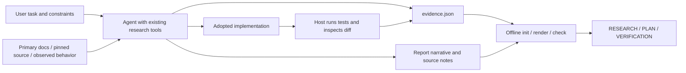

# Minimal architecture

One canonical [Agent Skill](../skills/research-first-build/SKILL.md), four progressively loaded guides,
templates, a versioned schema and one offline Python 3.11+ standard-library helper.



## Deterministic boundary

The helper validates the bundled schema subset, IDs and graph, classification shape, reuse records,
required checks, managed-table freshness, source/audit inputs and supplied implementation snapshots.
It renders tables into bounded Markdown blocks and writes advisory receipts atomically per file.
The renderer validates all blocks/destinations first; multiple report files are not one transactional write.
After interruption, rerender and recheck instead of trusting a cached stage.

The agent selects references, interprets evidence, audits actual support, chooses applicable architecture,
implements and executes tests. The helper neither fetches sources nor executes commands. No backend,
crawler, database, watcher, provider integration or separate package-manager-distributed RFB CLI.

## Deliberate decisions

| Decision | Reason / consequence |
| --- | --- |
| Portable core, not host forks | Same evidence contract everywhere; host discovery differs only by installation directory. |
| Python stdlib helper bundled with skill | Real trace/freshness checks without a service or pip install; explicit runtime prerequisite. |
| JSON canonical, Markdown human-first | Reliable links plus readable reasoning; managed tables prevent dual manual maintenance. |
| No automatic truth scoring | Factual meaning and provenance cannot be inferred from a populated schema. |
| PATTERN_ONLY default | Learn mechanisms without importing code/license obligations accidentally; unknown rights stay unknown. |
| No plugin manifests in candidate | Tested local copy/installer routes suffice. Add manifests only after a concrete host use case/spike. |
| No strict reference/rejection quota | Avoid irrelevant references and invented rejected options. |
| Three advisory cache stages | PLANNED / PREBUILD_CHECKED / COMPLETE represent receipts, not every reasoning phase or access permission. |

`schema_version: 1` is preserved. Unknown versions fail with artifacts intact; there is no silent migration.
The helper is not a general JSON Schema implementation; its maintained vocabulary is tested against the bundled schema.

## Repository layout

```text
skills/research-first-build/  independently installable product
  SKILL.md
  agents/openai.yaml
  references/
  assets/                    schema, incomplete ledger, report templates
  scripts/rfb.py
  LICENSE
examples/                    real-source educational builds + independent handoff
tests/                       clearly synthetic contract/render/packaging cases
tools/                       fixed local example checks, repository QA, packaging
evals/                       method, cases, honest observed results
docs/                        installation, contract, compatibility, release status
media/                       reproducible recorded-artifact animation
.github/                     offline checks and contribution templates
```
